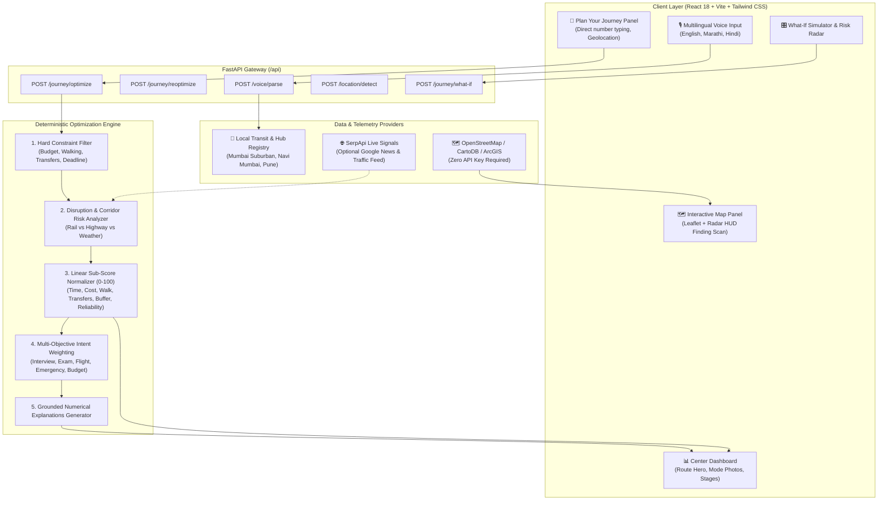

# 🧭 RouteWise — Risk-Aware Personal Mobility Decision Engine

<div align="center">

[](https://fastapi.tiangolo.com)
[](https://react.dev)
[](https://www.typescriptlang.org)
[](https://tailwindcss.com)
[](https://leafletjs.com)
[](https://python.org)
[](https://opensource.org/licenses/MIT)

### **“Don't just find a route. Find the journey most likely to get you there on time.”**

*A deterministic, multi-objective multimodal transit decision engine tailored for real-world commuter uncertainty, hard mobility constraints, and live transit signals.*

[Key Innovations](#-core-innovations) • [System Architecture](#-system-architecture) • [Decision Formula](#-multi-objective-scoring-formula) • [Voice & NLP](#-voice-assistant--nlp-engine) • [Interactive Map](#-zero-api-key-map-engine) • [Quick Start](#-quick-start) • [API Specs](#-api-endpoints)

</div>

---

## 🚀 The Core Problem

Traditional route planning applications (Google Maps, Apple Maps, generic transit apps) optimize purely for **static distance, ideal driving speed, or lowest nominal travel time**. 

However, real-world commuters with critical arrival deadlines (**job interviews, university exams, flights, emergency medical appointments**) experience daily transit volatility:

- ❌ **Tight Transfer Traps**: A 5-minute connection across crowded railway platforms frequently fails, causing missed connections.
- ❌ **Corridor Fragility**: Single-corridor highway routes turn a 40-minute drive into a 2-hour gridlock on a single vehicle breakdown.
- ❌ **Zero Safety Buffer**: Legacy apps claim arrival at 9:59 AM for a 10:00 AM interview, leaving zero margin for error.
- ❌ **Ignored Hard Constraints**: Commuters have non-negotiable physical constraints (maximum walking tolerance, budget limits, transfer thresholds).

**RouteWise eliminates this uncertainty:**
> RouteWise rigorously evaluates candidate journeys under **hard user constraints**, computes a **RouteWise Confidence Score (0–100)**, assesses **corridor disruption risks**, and recommends the **Pareto-optimal multimodal itinerary** with an actionable arrival safety buffer.

---

## 💡 Core Innovations

| Innovation | Legacy Route Planners | RouteWise Personal Mobility Engine |
| :--- | :--- | :--- |
| **Ranking Metric** | Fastest ETA / Shortest Distance | **Multi-Objective Pareto Confidence Score (0–100)** |
| **Hard Constraints** | Soft suggestions | **Guaranteed elimination** of budget, walk, and transfer violations |
| **Decision Transparency** | Black-box algorithm | **Grounded numerical explanations** & sub-score breakdowns |
| **Voice & Multilingual** | Single-field voice search | **Continuous speech** in English, Marathi, Hindi with instant parsing |
| **Map Rendering** | Expensive API keys & quotas | **100% Free OpenStreetMap & Leaflet Vector Engine (0 API Keys Required)** |
| **Disruption Awareness** | Reactive road color lines | **Real-time signal radar**, news checks, and dynamic re-routing |
| **What-If Simulation** | Re-type query from scratch | **Live real-time parameter stress-testing sliders** |

---

## 🏗️ System Architecture



---

## 🧮 Multi-Objective Scoring Formula

RouteWise computes transparent, normalized sub-scores ($S \in [0, 100]$) across seven core dimensions:

$$S_{\text{time}}, \quad S_{\text{cost}}, \quad S_{\text{walking}}, \quad S_{\text{transfers}}, \quad S_{\text{buffer}}, \quad S_{\text{reliability}}, \quad S_{\text{risk}}$$

### Overall Ranking Score:
$$\text{Score}_{\text{composite}} = \sum_{i \in \text{metrics}} (w_i \cdot S_i) - (w_{\text{risk}} \cdot P_{\text{disruption}})$$

### User Intent Presets:
| Intent Preset | Dominant Weights | Primary Commuter Goal |
| :--- | :--- | :--- |
| **👔 Interview** | Buffer ($0.26$), Reliability ($0.28$) | Guarantee generous arrival buffer; avoid risky connections |
| **🎓 Exam** | Buffer ($0.30$), Reliability ($0.30$), Walk ($0.10$) | Punctuality over cost; minimum physical fatigue |
| **✈️ Flight** | Buffer ($0.30$), Transfers ($0.20$) | Avoid missed connections; predictable arrival window |
| **🚨 Emergency** | Time ($0.65$), Reliability ($0.25$) | Absolute minimum transit duration |
| **👨‍👩‍👦 Family** | Walk ($0.25$), Transfers ($0.25$), Comfort ($0.20$) | Shorter walking distance, fewer stairs/transfers |
| **💰 Budget** | Cost ($0.60$), Time ($0.15$) | Lowest overall transit expenditure |
| **🧭 General** | Balanced ($0.20$ across all) | Harmonious trade-off between speed, cost, and comfort |

---

## 🎙️ Voice Assistant & NLP Engine

The voice interface integrates the **Web Speech API** paired with an intelligent local transit entity extractor:

1. **Continuous Speech Recognition**: Runs in continuous listening mode (`continuous = true`, `interimResults = true`), preventing premature 2-second cutoffs.
2. **Multilingual Support**: Supports code-switching between **English**, **मराठी (Marathi)**, and **हिंदी (Hindi)**.
3. **Smart Phrase Parsing**:
   - Connector detection: `from X to Y`, `X se Y`, `X te Y`, `X to Y`, `go to Y`.
   - Budget extraction: `under 50 rupees`, `budget 30`, `50 rupaye`.
   - Time extraction: `reach by 10:10 am`, `before 11:30`.
   - Walking limit: `less than 500 meters walking`, `kam chalna hai`.
4. **Resilient Local Fallback**: When offline or if speech input has background noise, users can switch to the integrated quick-type fallback without breaking workflow.

---

## 🗺️ Zero-API-Key Map Engine

Unlike applications dependent on expensive proprietary mapping APIs with credit card billing and usage ceilings, **RouteWise is 100% self-contained**:

- **Leaflet Vector Integration**: Zero billing, zero quotas, zero API keys required.
- **Multiple Visual Styles**:
  - 🏙️ **Street Map View**: High-contrast, clean CartoDB Voyager vector tiles.
  - 🛰️ **Satellite Imagery**: High-resolution ArcGIS World Imagery.
  - 🚦 **Dark / Traffic Mode**: CartoDB Dark vector tiles with highlighted transit corridors.
- **Dynamic Finding Radar HUD**:
  - Concentric radar ripple waves (`animate-radar-ripple`).
  - 360-degree sweeping radar beam (`animate-radar-sweep`).
  - Glowing crosshairs and central beacon.
  - Live rotating status ticker (*"Triangulating multimodal corridors..."*, *"Polling Suburban train timetables..."*).

---

## 📁 Repository Structure

```
routewise/
├── backend/
│   ├── app/
│   │   ├── main.py                     # FastAPI application entrypoint & middleware
│   │   ├── api/
│   │   │   ├── endpoints.py            # REST endpoints (optimize, reoptimize, what-if, voice)
│   │   │   └── schemas.py              # Pydantic validation schemas
│   │   ├── engine/                     # Core Mathematical Decision Engine
│   │   │   ├── constraints.py          # Hard constraint filtering (Budget, Walk, Transfers)
│   │   │   ├── normalization.py        # 0–100 sub-score normalizer
│   │   │   ├── risk.py                 # Corridor & disruption risk evaluator
│   │   │   ├── scoring.py              # Multi-objective Pareto scoring
│   │   │   ├── optimizer.py            # Candidate ranking pipeline
│   │   │   └── explanations.py         # Grounded numerical explanation generator
│   │   ├── services/
│   │   │   ├── voice_parser.py         # Multilingual transit NLP parser (EN, MR, HI)
│   │   │   ├── route_generator.py      # Multimodal candidate synthesis engine
│   │   │   ├── location_service.py     # IP & browser geolocation service
│   │   │   └── serpapi/                # Optional SerpApi live search & news client
│   │   └── models/
│   │       └── domain.py               # Domain models (JourneyRequest, CandidateRoute, etc.)
│   ├── tests/                          # Complete pytest suite (15 unit & integration tests)
│   ├── requirements.txt                # Python dependencies
│   └── pytest.ini                      # Pytest runner configuration
│
├── frontend/
│   ├── src/
│   │   ├── components/
│   │   │   ├── Navbar.tsx              # Top navigation bar with dark mode toggle & settings
│   │   │   ├── PlanYourJourney.tsx     # Left panel: Voice assistant & constraint inputs
│   │   │   ├── VoiceInput.tsx          # Continuous multilingual speech recognition modal
│   │   │   ├── CenterDashboard.tsx     # Center panel: Route hero card, photo stages, itinerary
│   │   │   ├── InteractiveMapPanel.tsx # Right panel: Leaflet map, Radar HUD & Route Overview
│   │   │   ├── TravelerPreferencesSidebar.tsx # Personalization slide-over panel
│   │   │   ├── WhatIfSimulator.tsx     # What-If parameter stress-testing simulator
│   │   │   ├── DecisionSensitivity.tsx # Sensitivity radar visualizer
│   │   │   ├── AlternativesModal.tsx   # Detailed route comparison modal
│   │   │   ├── ScoreBreakdownModal.tsx # Grounded Pareto score breakdown modal
│   │   │   ├── EvidenceModal.tsx       # Live disruption intelligence evidence modal
│   │   │   └── DisclaimerFooter.tsx    # Positioning notice & footer
│   │   ├── services/
│   │   │   └── api.ts                  # Backend API client with offline fallback
│   │   ├── types/
│   │   │   └── journey.ts              # TypeScript domain types
│   │   ├── App.tsx                     # Main 3-panel responsive layout
│   │   ├── index.css                   # Tailwind styles, radar keyframes & custom scrollbars
│   │   └── main.tsx                    # Application entrypoint
│   ├── tailwind.config.js              # Custom color palette & fonts
│   ├── vite.config.ts                  # Vite build configuration
│   └── package.json                    # Frontend dependencies & scripts
│
└── README.md                           # Documentation & Architecture Manifesto
```

---

## ⚡ Quick Start

### 1. Prerequisites
- **Python**: `3.10+` (Python 3.11 recommended)
- **Node.js**: `18+` & `npm`

---

### 2. Backend Setup
```bash
# Navigate to backend directory
cd backend

# Create virtual environment
python -m venv venv

# Activate virtual environment
# Windows (PowerShell):
.\venv\Scripts\Activate.ps1
# Linux / macOS:
source venv/bin/activate

# Install dependencies
pip install -r requirements.txt

# Run test suite to verify installation
pytest -v

# Start FastAPI development server
python -m uvicorn app.main:app --reload --host 0.0.0.0 --port 8000
```
Backend API will be running at `http://localhost:8000`.  
Interactive Swagger documentation is available at `http://localhost:8000/docs`.

> **Note on SerpApi (Optional):** RouteWise functions **100% autonomously without any API keys**. To optionally test live SerpApi Google News signals, add your key to `backend/.env`:
> ```env
> SERPAPI_API_KEY=your_key_here
> ```

---

### 3. Frontend Setup
```bash
# Navigate to frontend directory
cd frontend

# Install dependencies
npm install

# Start Vite React dev server
npm run dev
```
Open your browser at **`http://localhost:5173`**.

---

## 🧪 Testing & Quality Assurance

Run the comprehensive pytest suite to validate deterministic scoring, constraint filters, and APIs:

```bash
cd backend
pytest -v
```

### Verified Test Cases:
- ✅ `test_constraints.py`: Hard constraint filtering (budget, walk limit, max transfers, deadlines).
- ✅ `test_scoring.py`: Multi-objective Pareto scoring calculations & intent weighting.
- ✅ `test_optimizer.py`: Ranking shifts under road disruptions and transit delays.
- ✅ `test_api.py`: REST endpoint responses for `/journey/optimize`, `/journey/reoptimize`, and `/voice/parse`.

---

## 📡 API Endpoints Reference

### `POST /api/journey/optimize`
Calculates optimal multimodal candidate journeys based on user constraints and intent.
```json
// Request Body
{
  "origin": "Rabale, New Mumbai",
  "destination": "Thane",
  "arrival_deadline": "10:10 AM",
  "max_budget": 100.0,
  "max_walking_distance_meters": 1000.0,
  "max_transfers": 3,
  "intent": "general",
  "weights": {
    "reliability": 0.35,
    "time": 0.35,
    "cost": 0.20,
    "walking": 0.05,
    "comfort": 0.05
  }
}
```

### `POST /api/voice/parse`
Parses raw spoken speech (in English, Marathi, or Hindi) into structured journey constraints.
```json
// Request Body
{
  "speech_text": "Rabale se Thane jaana hai budget tees rupaye",
  "language": "hi"
}

// Response
{
  "origin": "Rabale, New Mumbai",
  "destination": "Thane",
  "max_budget": 30.0,
  "confidence": 0.95
}
```

### `POST /api/journey/reoptimize`
Re-evaluates routes when unexpected delays or accidents occur on a corridor.

### `GET /api/serpapi/status`
Verifies engine status: confirms `api_key_required_for_maps: false` and reports active fallback layers.

---

## 🗺️ Roadmap & Vision

1. **Real-Time GPS Geofencing**: Automatic connection recalculation when a commuter misses an intermediate train platform transfer.
2. **Crowdsourced Platform Density**: Live commuter density indicators for Mumbai Local general vs first-class coaches.
3. **Multi-Metropolitan Profiles**: Pre-calibrated multimodal engines for Delhi (DMRC), Bengaluru (Namma Metro), and London (TfL).
4. **Offline PWA Engine**: Edge caching for full offline journey assistance during tunnel and basement transit sections.

---

## 📄 License

This project is licensed under the **MIT License**.
