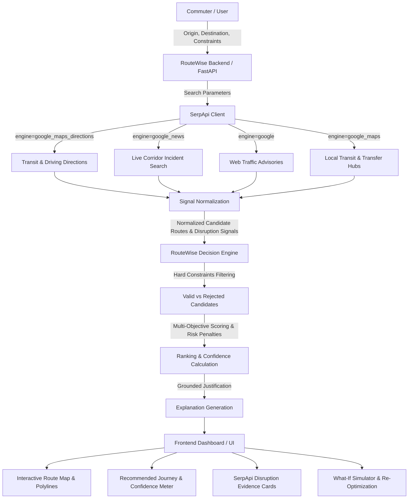

# RouteWise

> Risk-Aware Personal Mobility Decision Engine powered by SerpApi

RouteWise is a decision engine that helps commuters choose between multimodal journey options by evaluating total travel time, monetary cost, physical walking effort, interchange friction, and live disruption intelligence. Rather than treating travel as a single-metric shortest-path calculation, RouteWise balances personal constraints against corridor uncertainty.

**RouteWise does not simply find a route. It evaluates available journey options and explains why one option is recommended.**

---

## 1. The Problem

Traditional navigation and route-planning tools typically optimize for a single dimension—usually shortest travel time or minimal distance. In real-world travel, commuters face trade-offs and uncertainties that standard maps do not adequately account for:

- **Rigid User Constraints:** Hard deadlines (interviews, examinations, flight check-ins), strict financial budgets, and physical walking limits are rarely treated as strict boundaries.
- **Hidden Transfer & Walking Friction:** A route that looks 5 minutes faster on paper may involve multiple tight interchanges or steep walking distances that carry high failure risk.
- **Unmodeled Disruption Risk:** Static schedules cannot foresee breaking news, highway accidents, protests, waterlogging, or rail corridor mega-blocks.
- **Lack of Decision Transparency:** Commuters are presented with directions, but never an explanation of *why* an alternative was rejected or *how* a disruption affects their arrival safety buffer.

RouteWise turns route planning into a **decision-making problem** rather than simply displaying directions.

---

## 2. The Solution

RouteWise transforms commuter intent and live search intelligence into an explainable, risk-adjusted mobility decision through a structured decision pipeline:

```
User constraints & travel intent
        ↓
Candidate journey options (Transit & Road)
        ↓
Hard constraint filtering (Budget, Walking, Transfers, Deadline)
        ↓
Multi-objective score normalization
        ↓
SerpApi-powered disruption intelligence (News & Search)
        ↓
Risk and reliability adjustment (Corridor penalties & Confidence Score)
        ↓
Recommended route selection
        ↓
Evidence presentation & grounded numerical explanation
        ↓
Interactive What-If simulation / Dynamic re-optimization
```

Every stage of this workflow is implemented directly in the RouteWise application stack.

---

## 3. Why SerpApi?

SerpApi is **not** included as a cosmetic API call or an afterthought. It provides the **external live intelligence** that grounds RouteWise's decision-making in real-world conditions.

### How RouteWise Uses SerpApi

RouteWise integrates four distinct search engines through SerpApi (`backend/app/services/serpapi/`):

1. **`google_maps_directions` (`engine="google_maps_directions"`)**
   - Retrieves live multimodal candidate transit and driving itineraries (`travel_mode=3` for public transit; `travel_mode=0` for driving/cabs).
   - Extracts real-world duration, distance, transit agencies, interchange waypoints, and leg breakdowns.
2. **`google_news` (`engine="google_news"`)**
   - Scans current news indices for live incidents along the corridor (e.g., query: `"{origin} {destination} traffic delay accident"`).
   - Identifies breaking disruptions such as accidents, waterlogging, highway blockages, or train cancellations.
3. **`google` Web Search (`engine="google"`)**
   - Queries web advisories and corridor-level traffic updates to capture non-news municipal notices.
4. **`google_maps` Local Search (`engine="google_maps"`)**
   - Queries transfer points, stations, and local transit access hubs.

### The Intelligence Pipeline

```
RouteWise
  → Retrieves live corridor search & news via SerpApi
  → Normalizes signals into structured disruption models (severity, impact, source, url)
  → Calculates numerical risk penalties (P_disruption)
  → Feeds penalties directly into the deterministic decision engine
  → Adjusts candidate rankings, arrival safety buffers, and confidence scores
  → Surfaces verified news evidence and citations directly to the user
```

### Clarifying the Boundary

> **Route optimization is handled by RouteWise's own decision engine. SerpApi provides external search intelligence that enriches the decision.**

SerpApi does not run the multi-objective scoring formula, enforce user budgets, or rank candidate routes. RouteWise's internal engine executes all constraint filtering, normalization, scoring, and explanation generation.

### Why SerpApi Matters

Without SerpApi, a decision engine would have to rely entirely on static timetables or idealized road conditions, remaining blind to breaking disruptions. SerpApi supplies the live external signals needed to detect that an apparently "fast" expressway route is currently blocked, enabling RouteWise to steer the commuter toward a more dependable rail or metro alternative before they leave home.

---

## 4. Core Features

The following features are fully implemented and verified in the RouteWise codebase:

| Feature | Implementation Component | Verified Functionality |
| :--- | :--- | :--- |
| **Constraint-Based Filtering** | `backend/app/engine/constraints.py` | Eliminates routes exceeding user budget, walking threshold, transfer count, or arrival deadline. |
| **Multi-Objective Route Scoring** | `backend/app/engine/scoring.py` | Evaluates journeys across time, cost, comfort, walking, buffer, and reliability using intent presets. |
| **RouteWise Confidence Score** | `backend/app/engine/scoring.py` | Computes a bounded 0–100 score reflecting safety buffer, transfer count, mode reliability, and disruption penalty. |
| **Live Disruption Intelligence** | `backend/app/services/serpapi/disruptions.py` | Queries Google News via SerpApi to extract active road closures, accidents, and delay notices. |
| **SerpApi Evidence Drawer** | `frontend/src/components/DisruptionFeed.tsx` | Displays publisher, headline, timestamp, impact estimate, and direct links to source articles. |
| **Interactive What-If Simulator** | `frontend/src/components/WhatIfSimulator.tsx` | Allows real-time tweaking of budget, walking limit, transfers, and priorities with instant re-ranking. |
| **Dynamic Re-Optimization** | `backend/app/api/endpoints.py` (`/journey/reoptimize`) | Re-evaluates journey options when a corridor disruption is reported and highlights the recommendation delta. |
| **Explainable Recommendations** | `backend/app/engine/explanations.py` | Generates transparent, value-grounded comparisons detailing exact numerical savings over alternatives. |
| **Interactive Route Map** | `frontend/src/components/InteractiveMapPanel.tsx` | Leaflet-based map rendering route geometry, waypoints, transfer points, and corridor paths. |
| **Journey Comparison Matrix** | `frontend/src/components/AlternativesModal.tsx` | Side-by-side modal comparing trade-offs between Best Fit, Cheapest, Fastest, and Most Reliable routes. |
| **Autonomous Local Fallback** | `backend/app/services/route_generator.py` | Embedded multimodal route generator for key corridors when no SerpApi key is supplied or offline. |
| **Automated Test Suite** | `backend/tests/` | 17 pytest unit and integration tests covering endpoints, constraints, scoring, and optimizer logic. |

---

## 5. How RouteWise Makes a Decision

RouteWise uses a **deterministic multi-objective decision engine**. It does not use opaque black-box machine learning to guess recommendations; decisions are fully auditable, reproducible, and explainable.

### Decision Pipeline Stages

1. **Hard Constraint Filtering:**
   Every candidate route $r$ is checked against user constraints:
   - Estimated Cost $\le$ Max Budget
   - Walking Distance (meters) $\le$ Max Walking Distance
   - Transfer Count $\le$ Max Transfers
   - Arrival Buffer (minutes) $\ge$ 0 (if an arrival deadline is provided)
   
   Routes failing any constraint are disqualified from the recommended spot and cataloged with specific violation reasons.

2. **Sub-Score Normalization:**
   Candidate metrics are normalized on a relative 0–100 scale across all eligible candidates:
   - Duration score: $S_{\text{time}} = 100 \times \frac{\max(\text{dur}) - \text{dur}}{\max(\text{dur}) - \min(\text{dur}) + \epsilon}$
   - Cost score: $S_{\text{cost}} = 100 \times \frac{\max(\text{cost}) - \text{cost}}{\max(\text{cost}) - \min(\text{cost}) + \epsilon}$
   - Walking score: $S_{\text{walk}} = 100 \times \frac{\max(\text{walk}) - \text{walk}}{\max(\text{walk}) - \min(\text{walk}) + \epsilon}$
   - Transfer score: $S_{\text{transfer}} = \max(0, 100 - (\text{transfers} \times 25))$
   - Arrival buffer score: $S_{\text{buffer}} = \min(100, \max(0, \text{buffer} \times 2))$
   - Mode reliability score: $S_{\text{rel}}$ based on baseline historical punctuality of the transit mode.

3. **Risk & Disruption Penalty:**
   The risk engine assesses route vulnerability based on highway exposure, transfer tightness, and active SerpApi disruption signals:
   - $P_{\text{disruption}} = \sum \text{Impact}(\text{signal}) \times \text{SeverityWeight}$
   - High-severity incidents (closures, severe flooding) impose higher penalties than minor slowdowns.

4. **Multi-Objective Weighted Aggregation:**
   Objective weights are resolved from the user's travel intent preset (e.g., Interview, Exam, Flight, Emergency, Family, Budget, General) combined with any custom priority sliders:
   $$\text{Score} = (w_t \cdot S_{\text{time}} + w_c \cdot S_{\text{cost}} + w_w \cdot S_{\text{walk}} + w_{\text{tr}} \cdot S_{\text{transfer}} + w_b \cdot S_{\text{buffer}} + w_r \cdot S_{\text{rel}}) - P_{\text{disruption}}$$

5. **Final Ranking & Tagging:**
   Valid routes are ranked by overall score. The highest-scoring route is designated **Best Fit**. The engine also tags the **Cheapest**, **Fastest**, and **Most Reliable** routes for comparative inspection.

---

## 6. SerpApi Data Flow



---

## 7. System Architecture

RouteWise is organized as a decoupled two-tier architecture:

```
┌────────────────────────────────────────────────────────┐
│                   Frontend (React + Vite)              │
│  - Journey Input & Intent Presets                      │
│  - Leaflet Map (Route Polylines & Markers)             │
│  - Risk Radar & Confidence Meter                       │
│  - What-If Simulator & Disruption Evidence Drawer      │
└───────────────────────────┬────────────────────────────┘
                            │ HTTP / JSON REST
┌───────────────────────────▼────────────────────────────┐
│                   Backend (FastAPI)                    │
│  ├── API Routers (/api/journey, /api/demo, /api/voice) │
│  ├── RouteWise Decision Engine                         │
│  │     ├── Hard Constraint Filter                      │
│  │     ├── Sub-score Normalizer                        │
│  │     ├── Risk Engine & Disruption Penalty            │
│  │     ├── Intent-Weighted Scorer                      │
│  │     └── Deterministic Explainer                     │
│  ├── SerpApi Integration Service                       │
│  │     ├── Google Maps Directions Client               │
│  │     ├── Google News Disruption Monitor              │
│  │     └── Normalizer to CandidateRoute Domain Model   │
│  └── SQLite Database (Preferences & Recent Searches)   │
└────────────────────────────────────────────────────────┘
```

---

## 8. Tech Stack

| Layer | Technology | Purpose |
| :--- | :--- | :--- |
| **Backend Framework** | FastAPI 0.110+ | High-performance Python async REST API and OpenAPI documentation. |
| **Backend Runtime** | Python 3.11+ | Type-annotated backend service runtime. |
| **Validation & Schema** | Pydantic v2 | Strict request/response domain modeling and serialization. |
| **External Intelligence** | SerpApi | Live Google Maps directions and Google News disruption discovery. |
| **Numerical Processing** | NumPy | Mathematical array operations and score normalization. |
| **Local Persistence** | SQLite / SQLAlchemy | Lightweight local storage for user preferences and search history. |
| **Testing** | Pytest / HTTPX | Automated unit and integration test suite. |
| **Frontend Framework** | React 19 / TypeScript | Type-safe declarative single-page application. |
| **Build Tool** | Vite 8 | Fast frontend development and asset bundling. |
| **Styling** | TailwindCSS 3.4 | Utility-first responsive dark-mode user interface. |
| **Mapping** | Leaflet 1.9 / OpenStreetMap | Interactive client-side map rendering without proprietary map keys. |
| **Animation & Icons** | Framer Motion & Lucide React | Micro-interactions, slide-out drawers, and UI iconography. |

---

## 9. Project Structure

```
route-wise/
├── .env.example                 # Root environment variable template
├── README.md                    # Project documentation
├── routewise.db                 # Local SQLite database (auto-created)
│
├── backend/
│   ├── .env.example             # Backend environment template
│   ├── requirements.txt         # Python dependencies
│   ├── pytest.ini               # Pytest configuration
│   ├── app/
│   │   ├── main.py              # FastAPI application entry point and CORS configuration
│   │   ├── api/
│   │   │   ├── endpoints.py     # API route handlers (/journey, /demo, /preferences, /voice)
│   │   │   └── schemas.py       # Pydantic request and response schemas
│   │   ├── db/
│   │   │   ├── database.py      # SQLite connection and session management
│   │   │   └── models.py        # SQLAlchemy models for preferences and search history
│   │   ├── engine/
│   │   │   ├── constraints.py   # Hard constraint filtering logic
│   │   │   ├── normalization.py # Linear score normalization (0-100)
│   │   │   ├── risk.py          # Risk factor and disruption penalty calculation
│   │   │   ├── scoring.py       # Multi-objective weighted scoring & Confidence Score
│   │   │   ├── optimizer.py     # Main optimization pipeline orchestrator
│   │   │   └── explanations.py  # Value-grounded numerical justification generator
│   │   ├── models/
│   │   │   └── domain.py        # Core domain types (CandidateRoute, DisruptionSignal, etc.)
│   │   └── services/
│   │       ├── route_generator.py # Multimodal candidate route generator & fallback
│   │       ├── voice_parser.py    # Rule-based voice transcript parsing
│   │       └── serpapi/
│   │           ├── client.py      # SerpApi client for Google Maps & Google News
│   │           ├── disruptions.py # Live disruption query and signal extraction
│   │           └── normalizer.py  # Maps SerpApi directions responses to CandidateRoutes
│   └── tests/
│       ├── test_api.py          # API route endpoint integration tests
│       ├── test_constraints.py  # Hard constraint validation unit tests
│       ├── test_optimizer.py    # Optimization pipeline and re-optimization tests
│       └── test_scoring.py      # Scoring formula, presets, and confidence bounds tests
│
└── frontend/
    ├── package.json             # Frontend dependencies and scripts
    ├── vite.config.ts           # Vite configuration with API proxy (/api -> :8000)
    ├── tailwind.config.js       # TailwindCSS design tokens
    └── src/
        ├── App.tsx              # Main dashboard application layout
        ├── main.tsx             # React DOM root mounting
        ├── types/journey.ts     # TypeScript interfaces mirroring backend domain models
        ├── services/api.ts      # Axios/Fetch API client functions
        └── components/
            ├── PlanYourJourney.tsx    # Origin, destination, deadline, and constraint input form
            ├── InteractiveMapPanel.tsx# Leaflet map displaying route polylines and markers
            ├── CenterDashboard.tsx    # Recommended journey card, metrics, and action triggers
            ├── ScoreBreakdown.tsx     # Normalized sub-scores and weight visualization
            ├── RiskRadar.tsx          # Confidence meter, risk flags, and disruption alerts
            ├── DisruptionFeed.tsx     # SerpApi live evidence and news drawer
            ├── WhatIfSimulator.tsx    # Real-time constraint manipulation modal
            ├── AlternativesModal.tsx  # Side-by-side journey comparison matrix
            └── VoiceSearchModal.tsx   # Speech recognition input interface
```

---

## 10. Local Setup

> **RouteWise is designed to run locally for the hackathon demonstration; public deployment is not required by the project.**

Follow these steps to set up and run RouteWise locally.

### Prerequisites

- **Python 3.11+** installed
- **Node.js 18+** and **npm** installed
- A **SerpApi API key** (Optional for local testing; an autonomous internal fallback is included for offline demonstration)

### Step 1: Clone the Repository

```bash
git clone https://github.com/jayraj175coder/route-wise.git
cd route-wise
```

### Step 2: Backend Setup

Open a terminal and navigate to the `backend/` directory:

```bash
cd backend

# Create a virtual environment
python -m venv venv

# Activate the virtual environment
# Windows (PowerShell):
.\venv\Scripts\Activate.ps1
# macOS / Linux:
source venv/bin/activate

# Install dependencies
pip install -r requirements.txt
```

### Step 3: Configure Environment Variables

Create a `.env` file in the `backend/` directory using the provided template:

```bash
cp .env.example .env
```

Edit `backend/.env` and supply your SerpApi key:

```env
SERPAPI_API_KEY=your_serpapi_key_here
```

*(If you do not have an active SerpApi key, RouteWise runs using its internal multimodal candidate generator, keeping maps and optimization fully functional).*

### Step 4: Run the Backend Server

With the virtual environment activated, start the FastAPI development server:

```bash
uvicorn app.main:app --reload --host 0.0.0.0 --port 8000
```

The backend is now live at `http://localhost:8000`. You can verify API health at `http://localhost:8000/api/health` or browse interactive documentation at `http://localhost:8000/docs`.

### Step 5: Frontend Setup

Open a second terminal window and navigate to the `frontend/` directory:

```bash
cd frontend

# Install npm dependencies
npm install
```

### Step 6: Run the Frontend Application

Start the Vite development server:

```bash
npm run dev
```

The frontend application will start and display the local URL:
```
http://localhost:5173
```

Open `http://localhost:5173` in any modern web browser to interact with RouteWise.

---

## 11. Environment Variables

The project uses a single primary environment variable:

| Variable | Required | Default / Placeholder | Description |
| :--- | :---: | :--- | :--- |
| `SERPAPI_API_KEY` | Optional | `your_serpapi_api_key_here` | SerpApi key used to query Google Maps Directions, Google News, and Google Web search. |

> **Warning:** Never commit API keys or secrets to GitHub. Always store them in local, gitignored `.env` files.

---

## 12. Testing

The backend includes a comprehensive automated test suite built with **pytest** and **httpx**.

### Test Suite Summary

- **Total Tests:** 17 tests across 4 test modules (all passing).
- **Execution Time:** ~10 seconds.
- **Coverage Areas:**
  - `tests/test_api.py` (5 tests): Validates `/health`, `/serpapi/status`, `/journey/optimize`, `/demo/run`, and `/journey/what-if` endpoints.
  - `tests/test_constraints.py` (4 tests): Verifies hard constraint enforcement (budget ceilings, maximum walking distance, maximum transfers, arrival deadlines).
  - `tests/test_optimizer.py` (3 tests): Tests risk evaluation with active disruptions, re-optimization ranking shifts, and What-If parameter modification.
  - `tests/test_scoring.py` (4 tests): Tests intent preset weight blending, confidence score mathematical bounds [0, 100], and cost vs. reliability prioritization.

### Running Backend Tests

From the `backend/` directory with your virtual environment active:

```bash
pytest -v
```

Expected output:
```
tests/test_api.py::test_api_root PASSED
tests/test_api.py::test_api_health PASSED
tests/test_api.py::test_api_serpapi_status PASSED
tests/test_api.py::test_api_optimize_journey PASSED
tests/test_api.py::test_api_demo_run PASSED
tests/test_api.py::test_api_what_if PASSED
tests/test_constraints.py::test_budget_constraint_enforced PASSED
tests/test_constraints.py::test_walking_constraint_enforced PASSED
tests/test_constraints.py::test_transfer_constraint_enforced PASSED
tests/test_constraints.py::test_deadline_arrival_buffer_enforced PASSED
tests/test_optimizer.py::test_risk_evaluation_with_disruption PASSED
tests/test_optimizer.py::test_reoptimization_ranking_shift PASSED
tests/test_optimizer.py::test_what_if_budget_expansion PASSED
tests/test_scoring.py::test_intent_presets_weights PASSED
tests/test_scoring.py::test_confidence_score_bounds_and_disclaimer PASSED
tests/test_scoring.py::test_cheapest_wins_budget_mode PASSED
tests/test_scoring.py::test_reliable_wins_interview_mode PASSED

======================= 17 passed in 10.41s =======================
```

---

## 13. Demo Flow

For judges evaluating the application, the following walkthrough demonstrates the core decision workflow:

1. **Enter Origin and Destination:**
   Use the default corridor (e.g., *Dadar, Mumbai* to *Hinjawadi Phase 1, Pune*) or enter your own corridor.
2. **Configure Journey Constraints:**
   Set an Arrival Deadline (e.g., `10:10 AM`), a Maximum Budget (e.g., `₹1500`), and select the **Interview** intent preset.
3. **Generate Journey Options:**
   Click **"Optimize Journey"**. The engine retrieves candidate routes and filters out options violating constraints.
4. **Examine the Recommended Route:**
   Inspect the central recommendation card. Note the **RouteWise Confidence Score**, estimated travel time, total fare, and walking distance.
5. **Review Decision Reasoning:**
   Read the **"Why This Route?"** explanation box, which provides grounded numerical justifications comparing the top pick against the fastest and cheapest alternatives.
6. **Open SerpApi Disruption Evidence:**
   Click **"Disruptions"** or inspect the Risk Radar panel to view active incidents pulled from Google News via SerpApi, complete with publisher names, timestamps, and severity levels.
7. **Demonstrate Dynamic Re-Optimization ("Something Changed"):**
   Click **"Simulate Disruption"** or trigger re-optimization. Observe how highway delay signals cause the engine to downgrade cab routes and elevate rail options to protect the commuter's arrival buffer.
8. **Test the What-If Simulator:**
   Open the **"What-If Simulator"**, adjust budget or walking sliders, and see in real time whether the top recommendation shifts and why.

---

## 14. Hackathon Context

### SerpApi India Hackathon 2026

- **Track:** Travel & Local Discovery
- **Relevance:** Urban mobility in India is defined by multimodal complexity (suburban locals, metro lines, auto-rickshaws, shared cabs) and unpredictable disruptions (waterlogging, accidents, mega-blocks). RouteWise fits the Travel & Local Discovery track by turning chaotic navigation data into actionable, dependable travel decisions for Indian commuters.
- **SerpApi Materiality:** RouteWise does not call SerpApi for trivial lookups. SerpApi is integral to candidate generation (`google_maps_directions`, `google_maps`) and corridor risk intelligence (`google_news`, `google`). The live search signals directly alter route ranking scores, arrival confidence scores, and route recommendations.

---

## 15. AI Disclosure

To ensure complete transparency regarding the project's development and architecture:

- **AI Tools Used in Development:** Generative AI coding assistants (including GitHub Copilot and Google Antigravity / Gemini) were utilized during development for code authoring assistance, typing, and refactoring support.
- **Application Architecture:** The RouteWise decision engine itself is **100% deterministic**. It does **not** rely on opaque Large Language Model prompts or non-deterministic neural networks to calculate route scores, filter constraints, or rank journeys. All scoring equations, weight blending, constraint checks, and risk penalties are explicit mathematical algorithms implemented in Python.

---

## 16. Limitations & Honest Notes

- **External API Dependency:** When `SERPAPI_API_KEY` is provided, live directions and news queries depend on external SerpApi responsiveness and network connectivity. If the API is unreachable, RouteWise falls back to its internal multimodal engine.
- **Unstructured News Parsing:** While the disruption monitor extracts severity and impact from Google News snippets, news articles may occasionally lack hyper-precise kilometer markers.
- **Local Demonstration Scope:** RouteWise is packaged as a local development project; it does not currently run on a hosted cloud domain.
- **Transit Schedule Approximations:** Where live transit feeds do not provide real-time GPS telemetry for suburban buses or shared auto stands, RouteWise uses published timetable intervals and local transfer estimates.

---

## 17. Future Improvements

Future iterations planned for RouteWise include:

- **Real-Time Public Transit GTFS-RT Feeds:** Integrating live GPS feeds for city bus corporations (BEST, DTC, BMTC) alongside SerpApi search intelligence.
- **Hyper-Local Crowdsourced Incident Reports:** Allowing commuters to report platform congestion or auto-rickshaw availability at key stations.
- **Multi-City Corridor Expansion:** Pre-configuring corridor profiles and suburban rail networks for Bengaluru, Delhi-NCR, Chennai, and Kolkata.
- **Return Journey Optimization:** Simultaneous round-trip decision optimization with return deadline guarantees.

---

## 18. License

This repository does not currently include a formal standalone license file. All original code was created for the SerpApi India Hackathon 2026. Standard open-source evaluation terms apply for hackathon judging and demonstration purposes.
