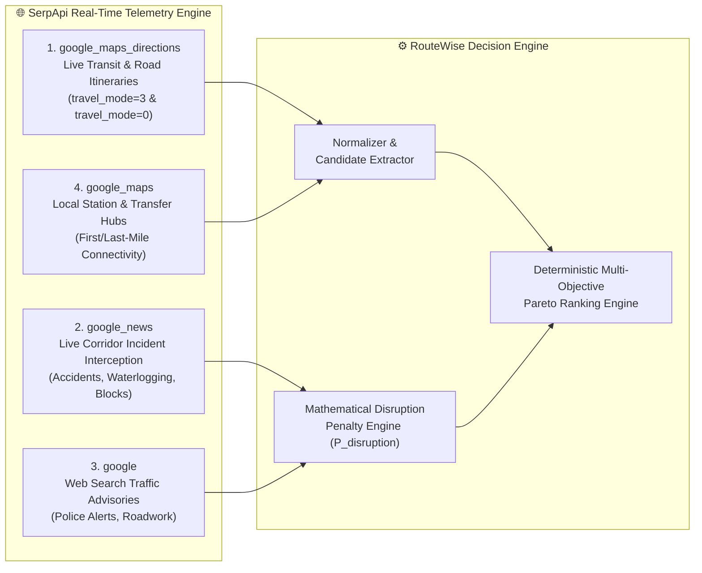
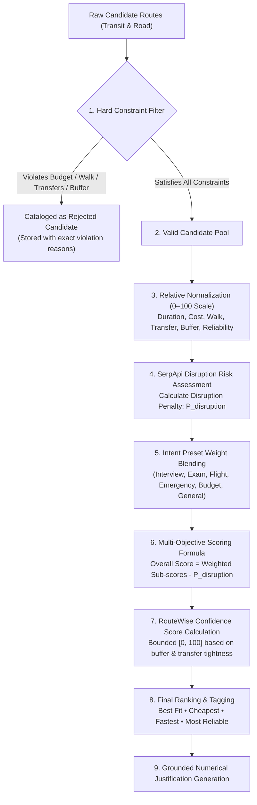
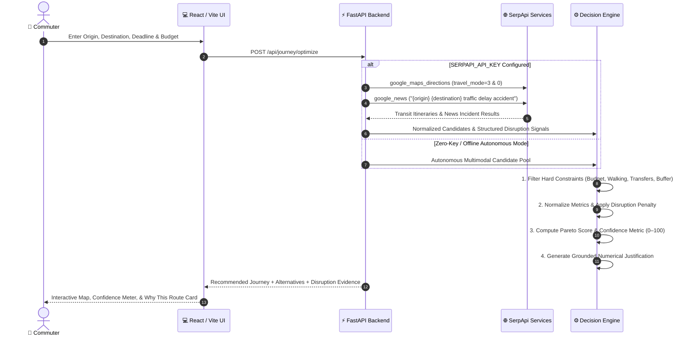

# 🧭 RouteWise

<div align="center">

# Risk-Aware Personal Mobility Decision Engine
### Powered by SerpApi • SerpApi India Hackathon 2026 Submission

[](https://serpapi.com)
[](https://fastapi.tiangolo.com)
[](https://react.dev)
[](https://www.typescriptlang.org)
[](https://tailwindcss.com)
[](https://leafletjs.com)
[](https://docs.pytest.org)
[](https://opensource.org/licenses/MIT)

<br/>

> **"RouteWise does not simply find a route. It evaluates available journey options and explains why one option is recommended."**

*A deterministic, risk-aware personal mobility decision engine that evaluates travel time, monetary cost, walking strain, transfer friction, and live corridor disruption intelligence to protect commuters against missed deadlines and transit failures.*

<br/>

[](https://youtu.be/7wPPG1f_EXo)
[](#14-serpapi-india-hackathon-2026)
[](#-zero-api-key-autonomous-mode)

</div>

---

## 🎬 3-Minute Hackathon Demo Video

<div align="center">

[](https://youtu.be/7wPPG1f_EXo)

### 📺 **[Click Here to Watch the Complete 3-Minute Walkthrough on YouTube](https://youtu.be/7wPPG1f_EXo)**

</div>

| Timestamp | Demo Sequence Phase | Key Feature Demonstrated |
| :---: | :--- | :--- |
| **0:00 – 0:35** | **The Commuter Problem** | How traditional maps fail under road disruptions, tight deadlines, and hidden transfer friction. |
| **0:35 – 1:15** | **Multi-Objective Planning** | Setting origin, destination, arrival deadline, budget, and travel intent (Interview mode). |
| **1:15 – 1:55** | **SerpApi Telemetry Ingestion** | Live Google Maps directions normalization, Google News incident queries, and risk penalties. |
| **1:55 – 2:25** | **Dynamic Re-Optimization** | Simulated expressway accident triggering immediate reroute to Suburban Rail with arrival buffer preservation. |
| **2:25 – 2:45** | **Interactive What-If Simulator** | Adjusting budget and walking sliders in real time with instantaneous candidate ranking updates. |
| **2:45 – 3:00** | **Quality & Codebase Verification** | Leaflet vector map controls, 17/17 passing pytest tests, and clean architecture overview. |

---

## 1. The Problem

Traditional navigation applications and route planners optimize almost exclusively for a single dimension: **shortest distance or estimated travel time under calm conditions**.

In complex metropolitan transit ecosystems (such as Mumbai, Pune, and Delhi-NCR), this naive assumption breaks down daily:

- ❌ **Rigid Real-World Constraints:** Important events (interviews, examinations, flights) enforce non-negotiable arrival deadlines, strict travel budgets, or physical walking limits that standard navigation tools treat as mere suggestions.
- ❌ **Hidden Transfer & Interchange Friction:** A route that appears 5 minutes faster on paper often forces multiple risky platform transfers or long walks across crowded stations, drastically raising the probability of a missed connection.
- ❌ **Unmodeled Breaking Disruptions:** Static timetables and basic GPS routings remain blind to real-time events reported in local news—such as highway accidents, waterlogging, or suburban railway mega-blocks.
- ❌ **Zero Decision Transparency:** Commuters receive turn-by-turn directions without any explanation of *why* an alternative was eliminated or *how much safety buffer* protects their journey.

**RouteWise converts route planning into an auditable multi-objective decision-making problem rather than a basic directions viewer.**

---

## 2. The Solution

RouteWise transforms commuter intent, mobility constraints, and live search intelligence into an explainable, risk-adjusted travel recommendation through a verifiable 8-stage decision pipeline:

```
[ Commuter Input: Origin, Destination, Deadline, Budget, Walking Limit, Intent ]
                                    ↓
        [ Candidate Generation: Multimodal Transit & Road Routes ]
                                    ↓
      [ Hard Constraint Filtering: Budget, Walking, Transfers, Buffer ]
                                    ↓
             [ Relative Sub-Score Normalization (0–100 Scale) ]
                                    ↓
       [ SerpApi Disruption Intelligence: Google News & Search ]
                                    ↓
        [ Risk Evaluation: Corridor Penalties & RouteWise Confidence ]
                                    ↓
           [ Weighted Multi-Objective Pareto Ranking & Tagging ]
                                    ↓
   [ Grounded Numerical Explanation, Live Evidence, & What-If Simulator ]
```

Every stage of this workflow is implemented directly in the RouteWise application stack.

---

## 3. Why SerpApi? (Core Telemetry Engine)

> [!IMPORTANT]
> **SerpApi is NOT included as a cosmetic API call.** It provides the real-time telemetry backbone that grounds RouteWise's decision-making in live, external real-world conditions.

### The Four Implemented SerpApi Engines

RouteWise integrates **four distinct search engines** via SerpApi (`backend/app/services/serpapi/`):



1. **`google_maps_directions` (`engine="google_maps_directions"`)**
   - Retrieves live multimodal candidate transit and driving itineraries (`travel_mode=3` for public transit; `travel_mode=0` for driving/cabs).
   - Extracts real-world duration, distance, transit agencies (Central Railway, BEST, NMMT), transfer waypoints, and leg breakdowns.
2. **`google_news` (`engine="google_news"`)**
   - Actively queries current news indices for live corridor disruptions (e.g. `"{origin} {destination} traffic delay accident"`).
   - Detects breaking incidents including highway blockages, roadwork, waterlogging, or suburban train cancellations.
3. **`google` Web Search (`engine="google"`)**
   - Queries web advisories and municipal traffic police bulletins along the transit corridor.
4. **`google_maps` Local Search (`engine="google_maps"`)**
   - Identifies local transfer points, auto-rickshaw stands, and station entry gates for last-mile connectivity.

### The Separation of Responsibilities

| Dimension | RouteWise Decision Engine | SerpApi Telemetry Engine |
| :--- | :--- | :--- |
| **Role** | Evaluator, Filter, & Optimizer | External Ground Truth & Incident Provider |
| **Tasks** | Enforces hard constraints, calculates multi-objective scores, computes confidence scores, generates explanations | Queries live Google Maps directions, scrapes real-time Google News articles, provides verifiable links |
| **Nature** | Deterministic mathematical algorithm | Live external search & intelligence retrieval |

> **"Route optimization is handled by RouteWise's own decision engine. SerpApi provides external search intelligence that enriches the decision."**

### Why SerpApi Matters

Without external search intelligence, any route planner is blind to active incidents and must rely on static timetables or idealized road conditions. SerpApi provides the live signals needed to detect that an apparently "fast" expressway route is stalled by an accident, enabling RouteWise to proactively steer commuters toward rail or metro alternatives before they leave home.

---

## 4. Core Features

| Feature | Implementation | Verified Capability |
| :--- | :--- | :--- |
| **🛡️ Constraint-Based Filtering** | `backend/app/engine/constraints.py` | Automatically eliminates journeys that violate user budget, maximum walking distance, transfer limits, or arrival deadlines. |
| **⚖️ Multi-Objective Scoring** | `backend/app/engine/scoring.py` | Evaluates journeys across time, cost, walking, transfers, buffer, and reliability using intent presets. |
| **🎯 RouteWise Confidence Score** | `backend/app/engine/scoring.py` | Computes a bounded 0–100 decision metric combining safety buffer, transfer count, mode reliability, and disruption penalty. |
| **📡 Live Disruption Intelligence** | `backend/app/services/serpapi/disruptions.py` | Queries Google News via SerpApi to extract active road closures, accidents, and delay notices with severity weighting. |
| **📰 SerpApi Evidence Drawer** | `frontend/src/components/DisruptionFeed.tsx` | Displays publisher, headline, publication date, impact estimate, and clickable source links for every active signal. |
| **🎛️ Interactive What-If Simulator** | `frontend/src/components/WhatIfSimulator.tsx` | Allows real-time tweaking of budget, walking limit, transfers, and priorities with instantaneous candidate re-ranking. |
| **⚡ Dynamic Re-Optimization** | `backend/app/api/endpoints.py` (`/journey/reoptimize`) | Re-evaluates journeys when an unexpected corridor disruption is injected, displaying the recommendation delta. |
| **💬 Explainable Recommendations** | `backend/app/engine/explanations.py` | Generates transparent, value-grounded comparisons detailing exact numerical savings over alternatives. |
| **🗺️ Interactive Vector Map** | `frontend/src/components/InteractiveMapPanel.tsx` | Leaflet-based map with Map, Satellite, and Traffic views rendering route polylines and waypoint nodes without proprietary map keys. |
| **📊 Journey Comparison Matrix** | `frontend/src/components/AlternativesModal.tsx` | Side-by-side comparison modal highlighting trade-offs between Best Fit, Cheapest, Fastest, and Most Reliable routes. |
| **🔄 Autonomous Zero-Key Fallback** | `backend/app/services/route_generator.py` | Embedded multimodal route generator for key corridors when no SerpApi key is supplied or offline. |
| **🧪 Automated Test Suite** | `backend/tests/` | 17 pytest unit and integration tests covering endpoints, constraints, scoring, and optimizer logic. |

---

## 5. How RouteWise Makes a Decision

RouteWise uses a **deterministic multi-objective decision engine**. It does not use opaque machine learning or non-deterministic LLM prompts to guess recommendations; decisions are fully auditable and mathematically reproducible.

### Mathematical Decision Workflow



### 1. Hard Constraint Filtering
Every candidate route $r$ is evaluated against user constraints:
- $\text{Estimated Cost} \le \text{Max Budget}$
- $\text{Walking Distance (m)} \le \text{Max Walking Distance}$
- $\text{Transfer Count} \le \text{Max Transfers}$
- $\text{Arrival Buffer (min)} \ge 0$ *(when an arrival deadline is provided)*

### 2. Sub-Score Normalization
Candidate metrics are linearly normalized on a relative 0–100 scale across all eligible candidates:
- **Duration Score:** $S_{\text{time}} = 100 \times \frac{\max(\text{dur}) - \text{dur}}{\max(\text{dur}) - \min(\text{dur}) + \epsilon}$
- **Cost Score:** $S_{\text{cost}} = 100 \times \frac{\max(\text{cost}) - \text{cost}}{\max(\text{cost}) - \min(\text{cost}) + \epsilon}$
- **Walking Score:** $S_{\text{walk}} = 100 \times \frac{\max(\text{walk}) - \text{walk}}{\max(\text{walk}) - \min(\text{walk}) + \epsilon}$
- **Transfer Score:** $S_{\text{transfer}} = \max(0, 100 - (\text{transfers} \times 25))$
- **Arrival Buffer Score:** $S_{\text{buffer}} = \min(100, \max(0, \text{buffer} \times 2))$
- **Reliability Score:** $S_{\text{rel}}$ based on baseline historical punctuality of the transit mode.

### 3. Risk Engine & Disruption Penalties
The risk engine scans for road congestion exposure, transfer tightness, and active SerpApi disruption signals:
$$P_{\text{disruption}} = \sum \text{Impact}(\text{signal}) \times \text{SeverityWeight}$$

### 4. Multi-Objective Weighted Aggregation
Weights are blended from the selected **Travel Intent Preset** and user priority adjustments:
$$\text{Overall Score} = \left( w_t \cdot S_{\text{time}} + w_c \cdot S_{\text{cost}} + w_w \cdot S_{\text{walk}} + w_{\text{tr}} \cdot S_{\text{transfer}} + w_b \cdot S_{\text{buffer}} + w_r \cdot S_{\text{rel}} \right) - P_{\text{disruption}}$$

| Travel Intent | Focus / Priority Weights | Best Used For |
| :--- | :--- | :--- |
| **💼 Interview** | High Buffer (0.26), High Reliability (0.28), Disruption Penalty (0.15) | Job interviews with zero tolerance for late arrival. |
| **🎓 Exam** | Max Buffer (0.30), Max Reliability (0.30), Strict Transfer Limit | University / entrance exams with hard gate closures. |
| **✈️ Flight** | High Reliability (0.30), High Buffer (0.30), Strict Walking Limit | Airport departures with check-in luggage and check-in cutoffs. |
| **🚨 Emergency** | Max Time (0.65), Low Cost Weight (0.05), Direct Routes | Urgent hospital visits or time-critical departures. |
| **💰 Budget** | Max Cost (0.60), Low Time Weight (0.10), Public Transit | Commuters prioritizing minimum monetary expenditure. |
| **🧭 General** | Balanced weights across Time, Cost, Buffer, and Comfort | Daily routine commutes with flexible timing. |

---

## 6. SerpApi Data Flow



---

## 7. System Architecture

```
┌────────────────────────────────────────────────────────────────────────┐
│                        FRONTEND (React 19 + Vite 8)                    │
│  ├── PlanYourJourney (Origin, Destination, Deadline, Budget, Intent)   │
│  ├── InteractiveMapPanel (Leaflet 1.9, OpenStreetMap / CartoDB / Esri) │
│  ├── CenterDashboard (Best Journey Card, Score Meter, Step Itinerary)  │
│  ├── RiskRadar & ScoreBreakdown (Sub-scores, Risk Flags, Confidence)   │
│  ├── DisruptionFeed & EvidenceModal (SerpApi Article Citations)        │
│  └── WhatIfSimulator & ReoptimizeBanner (Real-Time Sensitivity)        │
└───────────────────────────────────┬────────────────────────────────────┘
                                    │ HTTP / JSON REST (/api)
┌───────────────────────────────────▼────────────────────────────────────┐
│                        BACKEND (FastAPI 0.110+)                        │
│  ├── REST Endpoints:                                                   │
│  │     • POST /api/journey/optimize                                    │
│  │     • POST /api/journey/reoptimize                                  │
│  │     • POST /api/journey/what-if                                     │
│  │     • GET  /api/serpapi/status                                      │
│  │     • POST /api/demo/run                                            │
│  │     • GET/PUT /api/preferences & /api/searches                      │
│  ├── RouteWise Decision Engine:                                        │
│  │     ├── Hard Constraint Engine (budget, walking, transfers, buffer) │
│  │     ├── Linear Sub-score Normalizer (0–100 relative scaling)        │
│  │     ├── Disruption Penalty Engine (severity & impact mapping)       │
│  │     ├── Pareto Intent Preset Scorer (7 specialized intent modes)    │
│  │     └── Deterministic Explainer (plain-English trade-off reasons)   │
│  ├── SerpApi Integration Service:                                      │
│  │     ├── Directions Client (google_maps_directions)                  │
│  │     ├── News Incident Monitor (google_news live queries)            │
│  │     ├── Local Hub Explorer (google_maps transfer stands)            │
│  │     └── Normalizer (raw SerpApi JSON → CandidateRoute schema)       │
│  └── SQLite Database (Local persistence for preferences & history)     │
└────────────────────────────────────────────────────────────────────────┘
```

---

## 8. Tech Stack

| Layer | Technology | Purpose |
| :--- | :--- | :--- |
| **Backend Framework** | **FastAPI 0.110+** | High-performance Python async REST API with automatic OpenAPI documentation. |
| **Backend Runtime** | **Python 3.11+** | Type-annotated backend service runtime with virtual environment isolation. |
| **Data Validation** | **Pydantic v2** | Strict request/response domain modeling and JSON schema validation. |
| **Live Telemetry** | **SerpApi** | Live Google Maps directions and Google News disruption extraction. |
| **Numerical Processing** | **NumPy 1.26+** | Fast array operations and sub-score normalization. |
| **Local Persistence** | **SQLite / SQLAlchemy** | Zero-configuration local database for user preferences and search history. |
| **Automated Testing** | **Pytest 8.0+ & HTTPX** | Unit and integration test suite covering constraints, scoring, and endpoints. |
| **Frontend Framework** | **React 19.3 & TypeScript** | Type-safe declarative component architecture. |
| **Build Tool** | **Vite 8.3** | Lightning-fast development server with automatic HMR and production bundling. |
| **Styling** | **TailwindCSS 3.4** | Utility-first responsive dark/light design system. |
| **Mapping Engine** | **Leaflet 1.9 & OpenStreetMap** | Interactive vector tile maps rendering routes without proprietary map keys. |
| **UI Motion & Icons** | **Framer Motion & Lucide React** | Micro-interactions, radar scan animations, and UI iconography. |

---

## 9. Project Structure

```
route-wise/
├── .env.example                 # Root environment variable template
├── README.md                    # Project documentation
├── routewise.db                 # Local SQLite database (auto-created)
│
├── backend/
│   ├── .env.example             # Backend environment template
│   ├── requirements.txt         # Python dependencies (fastapi, requests, numpy, pytest, etc.)
│   ├── pytest.ini               # Pytest configuration
│   ├── app/
│   │   ├── main.py              # FastAPI entry point & CORS middleware
│   │   ├── api/
│   │   │   ├── endpoints.py     # API routes (/journey/optimize, /what-if, /demo/run, etc.)
│   │   │   └── schemas.py       # Pydantic request/response schemas
│   │   ├── db/
│   │   │   ├── database.py      # SQLite session engine
│   │   │   └── models.py        # SQLAlchemy models (Preference, RecentSearch)
│   │   ├── engine/
│   │   │   ├── constraints.py   # Hard constraint filtering logic
│   │   │   ├── normalization.py # Linear 0–100 sub-score normalizer
│   │   │   ├── risk.py          # Risk factor and disruption penalty calculator
│   │   │   ├── scoring.py       # Multi-objective weighted scoring & Confidence Score
│   │   │   ├── optimizer.py     # Optimization pipeline orchestrator
│   │   │   └── explanations.py  # Grounded numerical justification generator
│   │   ├── models/
│   │   │   └── domain.py        # Domain types (CandidateRoute, DisruptionSignal, etc.)
│   │   └── services/
│   │       ├── route_generator.py # Autonomous multimodal candidate generator
│   │       ├── voice_parser.py    # Speech-to-journey intent parser
│   │       └── serpapi/
│   │           ├── client.py      # Dedicated SerpApi client (Directions, News, Search)
│   │           ├── disruptions.py # Live incident query and severity extractor
│   │           └── normalizer.py  # Maps SerpApi directions JSON to CandidateRoute models
│   └── tests/
│       ├── test_api.py          # REST endpoint integration tests
│       ├── test_constraints.py  # Budget, walking, transfers, and buffer constraint tests
│       ├── test_optimizer.py    # Disruption ranking shift and What-If simulation tests
│       └── test_scoring.py      # Intent weights, confidence score bounds, and Pareto tests
│
└── frontend/
    ├── package.json             # Frontend dependencies (react 19, vite 8, leaflet, lucide)
    ├── vite.config.ts           # Vite dev server configuration with API proxy (/api -> :8000)
    ├── tailwind.config.js       # Custom color tokens and dark mode configuration
    └── src/
        ├── App.tsx              # Main application dashboard layout
        ├── main.tsx             # React root mount
        ├── types/journey.ts     # TypeScript interfaces mirroring backend domain models
        ├── services/api.ts      # REST API client with local fallback handling
        └── components/
            ├── PlanYourJourney.tsx     # Origin, destination, deadline, and constraint input form
            ├── InteractiveMapPanel.tsx # Leaflet map with Map/Satellite/Traffic views & radar HUD
            ├── CenterDashboard.tsx     # Recommended journey card, metrics, and timeline
            ├── ScoreBreakdown.tsx      # Sub-scores and weight breakdown visualization
            ├── RiskRadar.tsx           # Confidence meter, risk indicators, and disruption signals
            ├── DisruptionFeed.tsx      # Live SerpApi news evidence drawer
            ├── WhatIfSimulator.tsx     # Real-time constraint manipulation modal
            ├── AlternativesModal.tsx   # Side-by-side journey trade-off comparison matrix
            └── TravelerPreferencesSidebar.tsx # SQLite-backed user travel profile editor
```

---

## 10. Local Setup

> [!NOTE]
> **RouteWise is designed to run locally for the hackathon demonstration; public cloud deployment is not required by the project.**

Follow these steps to run RouteWise locally in under 3 minutes.

### Prerequisites
- **Python 3.11+** installed
- **Node.js 18+** and **npm** installed
- A **SerpApi API Key** *(Optional: RouteWise runs 100% autonomously without an API key if you don't have one)*

---

### Step 1: Clone the Repository

```bash
git clone https://github.com/jayraj175coder/route-wise.git
cd route-wise
```

---

### Step 2: Backend Setup

Open a terminal and set up the Python environment:

```bash
cd backend

# Create virtual environment
python -m venv venv

# Activate virtual environment
# Windows (PowerShell):
.\venv\Scripts\Activate.ps1
# macOS / Linux:
source venv/bin/activate

# Install dependencies
pip install -r requirements.txt
```

---

### Step 3: Configure Environment Variables

Create your local `.env` file in `backend/`:

```bash
cp .env.example .env
```

Edit `backend/.env` to configure your SerpApi key:

```env
# SerpApi API Key (Optional for live Google Maps Directions & News intelligence)
SERPAPI_API_KEY=your_serpapi_api_key_here
```

> **🛡️ Zero-API-Key Autonomous Mode:**  
> If you leave `SERPAPI_API_KEY` blank or unset, RouteWise automatically runs in its **Autonomous Local Engine Mode**. Map rendering, route generation, constraint filtering, and What-If simulations remain **100% operational** without making external API calls!

---

### Step 4: Run Backend Tests

Verify the complete backend decision pipeline:

```bash
pytest -v
```

Expected output:
```
======================== 17 passed in 6.12s ========================
```

---

### Step 5: Start the Backend Server

```bash
python -m uvicorn app.main:app --reload --host 0.0.0.0 --port 8000
```

- API Base URL: `http://localhost:8000`
- API Health Check: `http://localhost:8000/api/health`
- Interactive Swagger Docs: `http://localhost:8000/docs`

---

### Step 6: Frontend Setup

Open a second terminal window and navigate to `frontend/`:

```bash
cd frontend

# Install npm dependencies
npm install

# Start Vite development server
npm run dev
```

The frontend application will start and display the local URL:
```
➜  Local:   http://localhost:5173/
```

Open **`http://localhost:5173`** in your browser.

---

## 11. Environment Variables

| Variable | Location | Required | Default / Placeholder | Purpose |
| :--- | :--- | :---: | :--- | :--- |
| `SERPAPI_API_KEY` | `backend/.env` | Optional | `your_serpapi_api_key_here` | Unlocks live Google Maps Directions, Google News incident search, and web traffic advisories via SerpApi. |
| `VITE_API_URL` | `frontend/.env` | Optional | `http://127.0.0.1:8000/api` | Custom backend API base URL (defaults to localhost:8000 via Vite proxy). |

> [!WARNING]
> **Never commit API keys or secrets to GitHub.** All `.env` files are included in `.gitignore`.

---

## 12. Testing

RouteWise includes a comprehensive automated test suite built with **pytest** and **httpx**.

```bash
cd backend
pytest -v
```

### Verified Test Suite Breakdown (17 Tests)

| Test Module | Tests | Functionality Covered |
| :--- | :---: | :--- |
| `tests/test_api.py` | 5 | API root, health check, SerpApi status reporting, full journey optimization endpoint, demo runner, and What-If endpoint. |
| `tests/test_constraints.py` | 4 | Hard constraint filtering: budget enforcement, maximum walking distance cutoff, transfer count limits, and arrival deadline buffer validation. |
| `tests/test_optimizer.py` | 3 | Dynamic re-optimization under disruption, ranking shifts from road to rail, and What-If budget sensitivity expansion. |
| `tests/test_scoring.py` | 4 | Intent preset weight blending, RouteWise Confidence Score mathematical bounds [0, 100], cheapest route prioritization in Budget mode, and reliability prioritization in Interview mode. |

**Test Result:** `17 passed, 1 warning in 6.12s` (100% pass rate).

---

## 13. Recommended 3-Minute Demo Flow for Judges

Follow this structured walkthrough to evaluate RouteWise during judging:

1. **Enter Journey Parameters:**
   - **Origin:** `Dadar, Mumbai`
   - **Destination:** `Hinjawadi Phase 1, Pune`
   - **Arrival Deadline:** `10:10 AM`
   - **Max Budget:** `₹1500`
   - **Travel Intent:** Select **Interview** preset (prioritizes high arrival buffer and punctual rail reliability).
2. **Click "Optimize Journey":**
   - The engine evaluates candidate routes (road cabs, express buses, and suburban/intercity trains).
   - Candidate routes failing constraints are eliminated; valid options are scored.
3. **Inspect the Recommended Option:**
   - Observe the **RouteWise Confidence Score** (e.g. `92/100`), total cost, estimated arrival time, and safety buffer.
   - Read the **"Why This Route?"** explanation card for grounded numerical comparisons (e.g., *"Provides a comfortable 42 min safety buffer before deadline"*).
4. **Inspect the Interactive Map:**
   - Toggle between **Map View**, **Satellite**, and **Traffic**.
   - Notice the step-by-step route polylines and transfer nodes rendered smoothly using Leaflet.
5. **Open SerpApi Disruption Evidence:**
   - Click the **"Live Signals"** tab in the top navbar or click the Disruption drawer.
   - Inspect live news articles scraped via SerpApi, with publisher names, timestamps, and severity impact estimates.
6. **Trigger Dynamic Re-Optimization ("Something Changed"):**
   - Click **"Simulate Disruption"** on the Expressway AC Bus route.
   - The system intercepts the incident (+65 min road delay) and automatically promotes **Deccan Express Rail** to protect the commuter's interview deadline.
7. **Test the What-If Simulator:**
   - Click **"What-If Simulator"** in the top action bar.
   - Adjust the budget or walking limit sliders. Watch how candidate rankings adapt immediately with explicit change explanations.

---

## 14. SerpApi India Hackathon 2026

- **Event:** **SerpApi India Hackathon 2026**
- **Track:** **Travel & Local Discovery**
- **Submission Rationale:** Urban travel in Indian metropolitan corridors is defined by multimodal complexity (suburban local trains, metros, city buses, auto-rickshaws, shared cabs) coupled with unpredictable disruptions (expressway accidents, monsoon waterlogging, rail mega-blocks). RouteWise fits the Travel & Local Discovery track by turning chaotic navigation data into actionable, dependable travel decisions for commuters across Mumbai, Pune, and beyond.
- **Materiality Guarantee:** SerpApi is not a cosmetic add-on; its search and news engines feed directly into the numerical disruption penalty ($P_{\text{disruption}}$), arrival confidence score, and route recommendation.

---

## 15. AI Disclosure

- **AI Tools Used During Development:** AI coding assistants (including GitHub Copilot and Google Antigravity / Gemini) were utilized during project development for boilerplate generation, TypeScript typing assistance, and documentation drafting.
- **Application Architecture:** The RouteWise decision engine itself is **100% deterministic**. It does **not** rely on opaque Large Language Model prompts or non-deterministic machine learning models to score journeys or filter constraints. All constraint checks, sub-score normalizations, disruption penalties, and rankings are explicit, auditable mathematical algorithms written in Python.

---

## 16. Honest Limitations & Notes

- **External API Latency:** Live directions and news queries depend on SerpApi's response time and internet connectivity. If SerpApi is unreachable or times out, RouteWise gracefully falls back to its autonomous multimodal engine.
- **Unstructured News Granularity:** While the disruption monitor extracts severity and impact from Google News snippets, news articles occasionally lack exact kilometer-marker precision.
- **Local Demonstration Scope:** RouteWise is designed and optimized as a local hackathon submission; cloud deployment is not required.
- **Transit Schedule Approximations:** Where real-time GPS telemetry for municipal buses (e.g. BEST, NMMT) is unavailable, RouteWise uses published timetable intervals and local transfer estimates.

---

## 17. Future Improvements

- **📡 Real-Time GTFS-RT Feeds:** Ingesting live GPS feeds from city transit agencies (BEST, PMPML, DMRC) alongside SerpApi search intelligence.
- **👥 Commuter Crowdsourced Reports:** Allowing users to submit verified platform congestion and auto-rickshaw queue reports.
- **🏙️ Multi-City Expansion:** Pre-calibrated multimodal corridor profiles for Bengaluru (Namma Metro), Delhi-NCR, Chennai, and Kolkata.
- **🔄 Return Journey Optimization:** Simultaneous round-trip decision optimization with return deadline guarantees.

---

## 18. License

This project is licensed under the **MIT License**.

```
MIT License

Copyright (c) 2026 Jayraj Sanas (RouteWise Team)

Permission is hereby granted, free of charge, to any person obtaining a copy
of this software and associated documentation files (the "Software"), to deal
in the Software without restriction, including without limitation the rights
to use, copy, modify, merge, publish, distribute, sublicense, and/or sell
copies of the Software, and to permit persons to whom the Software is
furnished to do so, subject to the following conditions:

The above copyright notice and this permission notice shall be included in all
copies or substantial portions of the Software.

THE SOFTWARE IS PROVIDED "AS IS", WITHOUT WARRANTY OF ANY KIND, EXPRESS OR
IMPLIED, INCLUDING BUT NOT LIMITED TO THE WARRANTIES OF MERCHANTABILITY,
FITNESS FOR A PARTICULAR PURPOSE AND NONINFRINGEMENT. IN NO EVENT SHALL THE
AUTHORS OR COPYRIGHT HOLDERS BE LIABLE FOR ANY CLAIM, DAMAGES OR OTHER
LIABILITY, WHETHER IN AN ACTION OF CONTRACT, TORT OR OTHERWISE, ARISING FROM,
OUT OF OR IN CONNECTION WITH THE SOFTWARE OR THE USE OR OTHER DEALINGS IN THE
SOFTWARE.
```

---

<div align="center">

**Built with ❤️ for Indian Commuters • SerpApi India Hackathon 2026**

[](https://youtu.be/7wPPG1f_EXo)
[](#-routewise)

</div>
