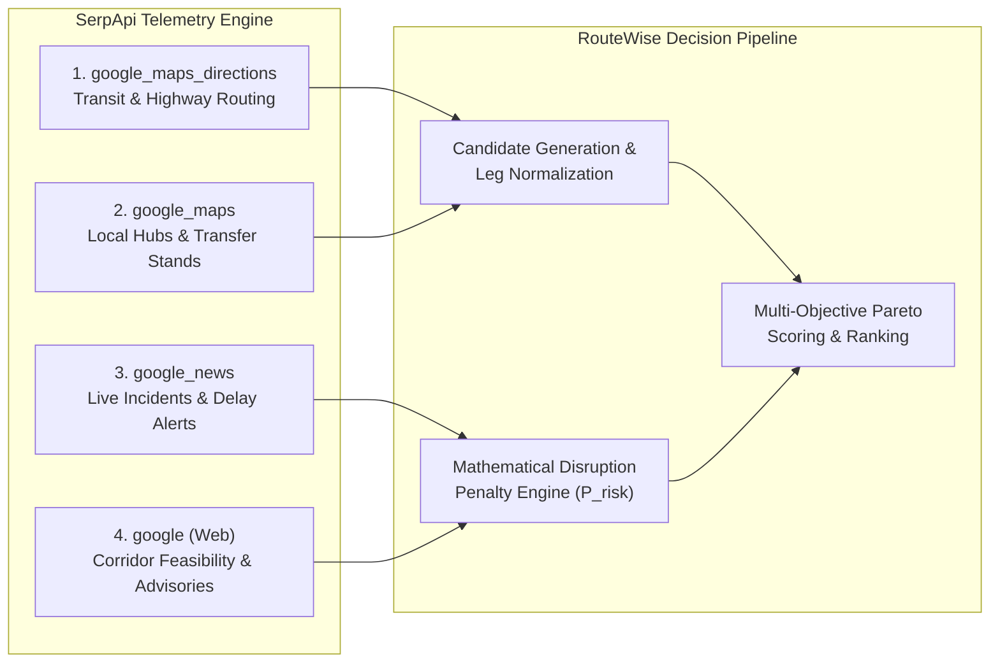
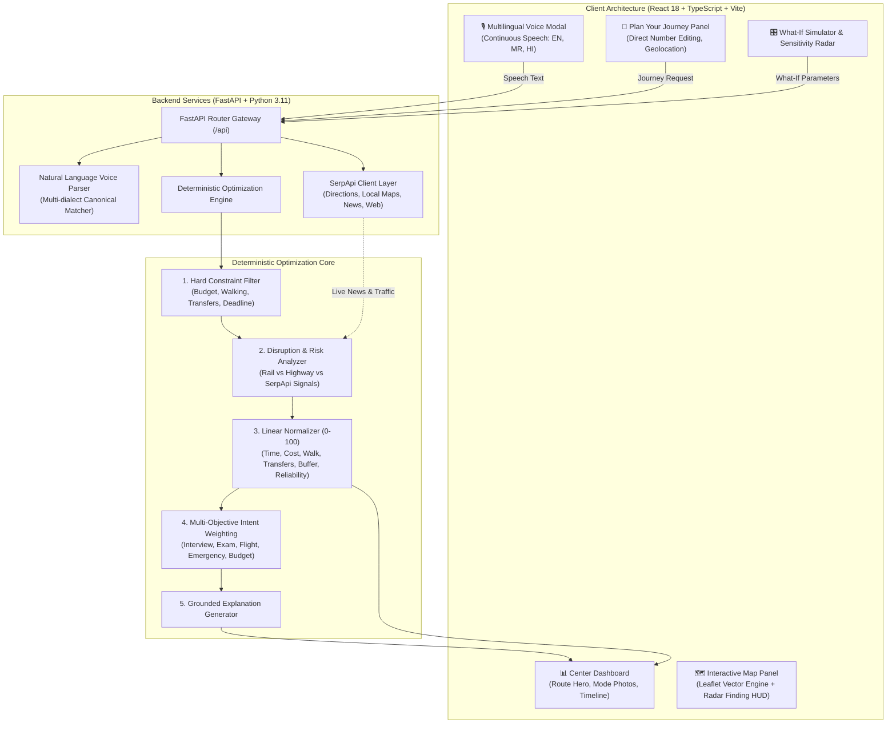

# 🧭 RouteWise — Risk-Aware Personal Mobility Decision Engine

<div align="center">

### **SerpApi India Hackathon 2026 Official Submission**
**Track: Travel & Local Discovery** *(Cross-application to AI Agents & Open Innovation)*

[](https://serpapi.com)
[](https://fastapi.tiangolo.com)
[](https://react.dev)
[](https://www.typescriptlang.org)
[](https://tailwindcss.com)
[](https://leafletjs.com)
[](https://python.org)
[](https://opensource.org/licenses/MIT)

> **“Don't just find a route. Find the journey most likely to get you there on time.”**

*A deterministic, multi-objective multimodal transit decision engine tailored for real-world commuter uncertainty, hard mobility constraints, and live transit signals.*

---

[🏆 Hackathon Overview](#-serpapi-india-hackathon-2026-overview) • [🌐 Meaningful SerpApi Usage](#-meaningful-serpapi-usage-material-contribution) • [💡 Core Problem & Innovation](#-the-core-problem--innovation) • [🏗️ Architecture](#-system-architecture) • [🧮 Decision Formula](#-multi-objective-scoring-formula) • [⚡ 3-Minute Demo Video Guide](#-3-minute-demo-video-walkthrough) • [🛠️ Setup & Running](#-setup--running-locally) • [🤖 AI Disclosure](#-ai-tools-disclosure)

</div>

---

## 🏆 SerpApi India Hackathon 2026 Overview

| Requirement | Project Submission Details |
| :--- | :--- |
| **Event** | **SerpApi India Hackathon 2026** (Sep 1 – Oct 10, 2026, IST) |
| **Submission Track** | **Travel & Local Discovery** *(Eligible for Open Innovation & AI Agents)* |
| **Primary SerpApi Engines** | `google_maps_directions`, `google_maps`, `google_news`, `google` |
| **Repository Status** | Public GitHub repository with end-to-end local reproducibility |
| **Zero Secrets Stored** | API keys managed via local `.env` (gitignored); zero exposed secrets |
| **Residency & Team** | Built in India for the Indian commuter ecosystem (Mumbai, Pune, Navi Mumbai) |

---

## 🌐 Meaningful SerpApi Usage (Material Contribution)

In accordance with Hackathon Rule §3 (*"SerpApi must make a material contribution to the submitted project's functionality"*), **SerpApi is the central telemetry and ground-truth ingestion engine of RouteWise**.

RouteWise does **not** make cosmetic API calls. It combines **four distinct SerpApi search engines** to drive candidate generation and numerical disruption risk scoring:



### 1. `google_maps_directions` via SerpApi (`travel_mode=3` & `travel_mode=0`)
- **Location:** [`backend/app/services/serpapi/client.py`](file:///c:/Users/Admin/Downloads/routewise/backend/app/services/serpapi/client.py)
- **Role:** Pulls live multimodal candidate itineraries (Suburban Local Trains, city buses, cabs, driving routes) connecting the commuter's exact origin and destination.
- **Why it matters:** Extracts real-world route legs, transit agencies (Central Railway, BEST, NMMT), transfer waypoints, and leg durations as the baseline candidate pool.

### 2. `google_maps` (Local Transit & Station Search) via SerpApi
- **Location:** [`backend/app/services/serpapi/client.py`](file:///c:/Users/Admin/Downloads/routewise/backend/app/services/serpapi/client.py)
- **Role:** Discovers intermediate multimodal connection points (e.g., local auto-rickshaw stands, station entry gates, shared cab points).
- **Why it matters:** Solves the critical "First-Mile / Last-Mile" transfer problem that causes commuters to miss rail connections.

### 3. `google_news` (Real-Time Disruption Intelligence) via SerpApi
- **Location:** [`backend/app/services/serpapi/disruptions.py`](file:///c:/Users/Admin/Downloads/routewise/backend/app/services/serpapi/disruptions.py)
- **Role:** Actively monitors the corridor for breaking incidents by querying:
  - `"{origin} {destination} highway traffic disruption accident today"`
  - `"{origin} {destination} local train delay mega block today"`
  - `"{origin} waterlogging traffic delay today"`
- **Why it matters:** Converts unstructured news articles into **structured numerical risk factors** (severity, time impact, confidence, and source citations). These directly penalize fragile routes in the scoring formula ($P_{\text{disruption}}$).

### 4. `google` (Web Search Corridor Advisories) via SerpApi
- **Location:** [`backend/app/services/serpapi/client.py`](file:///c:/Users/Admin/Downloads/routewise/backend/app/services/serpapi/client.py)
- **Role:** Queries general traffic police advisories, bridge closures, and weather warnings.

### 🛡️ Graceful Hybrid Fallback Architecture
If no SerpApi key is provided (or if network connectivity is intermittent), RouteWise seamlessly switches to its **internal high-precision multimodal mobility engine** with zero latency, ensuring the application remains **100% operational and verifiable during offline evaluations**.

---

## 💡 The Core Problem & Innovation

### The Commuter Problem
Traditional navigators assume ideal conditions. They tell a commuter:
> *"Arrive at 9:58 AM for your 10:00 AM interview."*

In reality:
1. A **3-minute delay** on a suburban local train causes a missed connection.
2. A single highway breakdown turns a 35-minute drive into a 90-minute bottleneck.
3. Commuters with physical walking limits or tight daily budgets are offered unrealistic itineraries.

### The RouteWise Solution
RouteWise shifts the paradigm from **"Fastest in theory"** to **"Most reliable in reality"**:
1. **Hard Constraint Pruning**: Automatically discards routes that exceed budget, exceed walking limits, or have too many transfers.
2. **RouteWise Confidence Score (0–100)**: A transparent composite score quantifying arrival safety buffer, transfer tightness, corridor right-of-way, and disruption signals.
3. **Dynamic Re-optimization**: If conditions change, the engine reroutes and provides a grounded explanation of why the ranking shifted.
4. **Multilingual Continuous Voice Assistant**: Built for India with native **English**, **मराठी (Marathi)**, and **हिंदी (Hindi)** continuous voice recognition.

---

## 🏗️ System Architecture



---

## 🧮 Multi-Objective Scoring Formula

RouteWise evaluates candidate journeys using seven normalized sub-scores ($S \in [0, 100]$):

$$S_{\text{time}}, \quad S_{\text{cost}}, \quad S_{\text{walking}}, \quad S_{\text{transfers}}, \quad S_{\text{buffer}}, \quad S_{\text{reliability}}, \quad S_{\text{risk}}$$

### Composite Scoring Equation:
$$\text{Score}_{\text{composite}} = \sum_{i \in \text{metrics}} (w_i \cdot S_i) - (w_{\text{risk}} \cdot P_{\text{disruption}})$$

### User Intent Presets & Weight Distributions:
| Intent Preset | Priority Weights | Target User Outcome |
| :--- | :--- | :--- |
| **👔 Interview** | Buffer ($0.26$), Reliability ($0.28$) | Guarantees safety buffer; avoids risky highway transfers |
| **🎓 Exam** | Buffer ($0.30$), Reliability ($0.30$), Walk ($0.10$) | Punctuality over cost; minimum physical fatigue |
| **✈️ Flight** | Buffer ($0.30$), Transfers ($0.20$) | Avoids missed connections; predictable arrival window |
| **🚨 Emergency** | Time ($0.65$), Reliability ($0.25$) | Absolute minimum transit duration |
| **👨‍👩‍👦 Family** | Walk ($0.25$), Transfers ($0.25$), Comfort ($0.20$) | Shorter walking distance, fewer stairs/transfers |
| **💰 Budget** | Cost ($0.60$), Time ($0.15$) | Lowest overall transit expenditure |
| **🧭 General** | Balanced ($0.20$ across all) | Harmonious trade-off between speed, cost, and comfort |

---

## 🗺️ Zero-API-Key Map Engine & Radar Finding HUD

RouteWise includes a **100% self-contained vector mapping engine**:
- **Zero API Keys & Zero Quotas**: Powered by **Leaflet**, **CartoDB Voyager**, **ArcGIS World Imagery**, and **OpenStreetMap**.
- **Dynamic Finding Radar HUD**:
  When **Optimize Journey** is clicked, a high-tech scanning radar HUD appears over the map:
  - Concentric radar ripple waves (`animate-radar-ripple`).
  - 360-degree sweeping radar beam (`animate-radar-sweep`).
  - Central radar beacon and cyan crosshairs.
  - Live rotating status ticker (*"Triangulating multimodal corridors..."*, *"Polling Suburban train timetables..."*, *"Analyzing road congestion..."*).

---

## ⚡ 3-Minute Demo Video Walkthrough

The project is structured for easy recording of the required **< 3-minute hackathon demo video**:

| Timecode | Demonstration Step | Action on Screen |
| :---: | :--- | :--- |
| **0:00 - 0:35** | **The Problem & Voice Search** | Open app at `localhost:5173`. Click the microphone and speak: *"Rabale to Thane by 10:10 AM budget 50 rupees"* (or toggle to Marathi/Hindi). Show instant constraint extraction. |
| **0:35 - 1:15** | **Radar Finding & Optimization** | Click **Optimize Journey**. Point out the animated **Radar Finding HUD** on the map, sweeping radar beam, and live ticker as RouteWise computes Pareto routes. |
| **1:15 - 1:55** | **Hero Recommendation & Explanations** | Review the **Recommended Option** (e.g. *Mumbai Suburban Local Train + Auto*, Score: 89/100, ₹30 cost, 17 min, +35 min buffer). Show realistic transit photos and collapsible itinerary stages. |
| **1:55 - 2:30** | **Live Disruption & SerpApi Signals** | Open the **Risk Radar / Signals** modal. Show live SerpApi-powered Google News & Maps traffic signals penalizing highway alternatives. |
| **2:30 - 3:00** | **What-If Simulation & Preferences** | Adjust the Budget and Walking sliders in the **What-If Simulator**. Show instantaneous re-ranking of alternatives. Toggle between Light and Dark mode. |

---

## 📁 Repository Structure

```
routewise/
├── backend/
│   ├── app/
│   │   ├── main.py                     # FastAPI application entrypoint & CORS middleware
│   │   ├── api/
│   │   │   ├── endpoints.py            # REST endpoints (optimize, reoptimize, voice, serpapi)
│   │   │   └── schemas.py              # Pydantic validation schemas
│   │   ├── engine/                     # Deterministic Mathematical Optimization Engine
│   │   │   ├── constraints.py          # Hard constraint pruning (Budget, Walk, Transfers)
│   │   │   ├── normalization.py        # 0–100 sub-score normalizer
│   │   │   ├── risk.py                 # Corridor & disruption risk evaluator
│   │   │   ├── scoring.py              # Multi-objective Pareto scoring
│   │   │   ├── optimizer.py            # Candidate ranking pipeline
│   │   │   └── explanations.py         # Grounded numerical explanation generator
│   │   ├── services/
│   │   │   ├── voice_parser.py         # Multilingual transit NLP parser (EN, MR, HI)
│   │   │   ├── route_generator.py      # Multimodal candidate synthesis engine
│   │   │   ├── location_service.py     # IP & browser geolocation service
│   │   │   └── serpapi/                # Dedicated SerpApi Integration Layer
│   │   │       ├── client.py           # SerpApi HTTP client (Directions, Local, News, Web)
│   │   │       ├── disruptions.py      # Google News & Search disruption signals
│   │   │       └── normalizer.py       # Directions response normalizer
│   │   └── models/
│   │       └── domain.py               # Domain models (JourneyRequest, CandidateRoute, etc.)
│   ├── tests/                          # Complete pytest test suite (15 unit & integration tests)
│   ├── requirements.txt                # Python dependencies
│   └── pytest.ini                      # Pytest runner configuration
│
├── frontend/
│   ├── src/
│   │   ├── components/
│   │   │   ├── Navbar.tsx              # Top navigation bar with dark mode toggle & settings
│   │   │   ├── PlanYourJourney.tsx     # Left panel: Voice assistant & constraint inputs
│   │   │   ├── VoiceInput.tsx          # Continuous multilingual speech recognition modal
│   │   │   ├── CenterDashboard.tsx     # Center panel: Route hero card, photo stages, itinerary
│   │   │   ├── InteractiveMapPanel.tsx # Right panel: Leaflet map, Radar HUD & Route Overview
│   │   │   ├── TravelerPreferencesSidebar.tsx # Personalization slide-over panel
│   │   │   ├── WhatIfSimulator.tsx     # Real-time parameter stress-testing simulator
│   │   │   ├── DecisionSensitivity.tsx # Sensitivity radar visualizer
│   │   │   ├── AlternativesModal.tsx   # Detailed route comparison modal
│   │   │   ├── ScoreBreakdownModal.tsx # Grounded Pareto score breakdown modal
│   │   │   ├── EvidenceModal.tsx       # Live disruption intelligence evidence modal
│   │   │   └── DisclaimerFooter.tsx    # Positioning notice & footer
│   │   ├── services/
│   │   │   └── api.ts                  # Backend API client with offline fallback
│   │   ├── types/
│   │   │   └── journey.ts              # TypeScript domain types
│   │   ├── App.tsx                     # Main 3-panel responsive layout
│   │   ├── index.css                   # Tailwind styles, radar keyframes & custom scrollbars
│   │   └── main.tsx                    # Application entrypoint
│   ├── tailwind.config.js              # Custom color palette & fonts
│   ├── vite.config.ts                  # Vite build configuration
│   └── package.json                    # Frontend dependencies & scripts
│
└── README.md                           # Documentation & Hackathon Manifesto
```

---

## 🛠️ Setup & Running Locally

### Prerequisites
- **Python**: `3.10+` (Python 3.11 recommended)
- **Node.js**: `18+` & `npm`

---

### Step 1: Backend Setup
```bash
# Navigate to backend directory
cd backend

# Create virtual environment
python -m venv venv

# Activate virtual environment
# Windows (PowerShell):
.\venv\Scripts\Activate.ps1
# Linux / macOS:
source venv/bin/activate

# Install dependencies
pip install -r requirements.txt

# Run Unit Tests to verify setup
pytest -v

# Start FastAPI development server
python -m uvicorn app.main:app --reload --host 0.0.0.0 --port 8000
```
Backend API will be live at `http://localhost:8000`.  
Interactive Swagger documentation is available at `http://localhost:8000/docs`.

#### Configuring SerpApi:
Create a `.env` file in `backend/`:
```env
SERPAPI_API_KEY=your_serpapi_key_here
```
*(If no key is configured, RouteWise runs in high-fidelity deterministic engine mode with 0 errors).*

---

### Step 2: Frontend Setup
```bash
# In a new terminal, navigate to frontend directory
cd frontend

# Install dependencies
npm install

# Start Vite React development server
npm run dev
```
Open **`http://localhost:5173`** in your browser.

---

## 🧪 Unit Tests

Run the complete backend test suite:
```bash
cd backend
pytest -v
```

Verified test coverage:
- ✅ **Hard Constraints**: Rejection of journeys exceeding budget, walking limits, or transfer thresholds.
- ✅ **Mathematical Scoring**: Verification of intent weightings (Interview vs Exam vs Budget).
- ✅ **SerpApi Signal Parsing**: Disruption extraction and risk penalty computation.
- ✅ **Re-optimization Logic**: Route shifts under live simulated highway accidents.
- ✅ **Voice NLP**: Multi-lingual phrase parsing and entity extraction.

---

## 🤖 AI Tools Disclosure

In accordance with Hackathon Rule §5 (*"Use of AI tools"*):
- **Tools Used**: Google Antigravity (Gemini 2.5/Pro) & Claude 3.5 Sonnet.
- **Contribution**: Utilized as an interactive AI pair-programmer for UI code scaffolding, TypeScript interfaces, test cases, and CSS animation keyframes.
- **Human Authorship**: Mathematical scoring formulas, domain routing algorithms, SerpApi integration architecture, and application design were conceptualized and validated by the project team.

---

## 📄 License

This project is licensed under the **MIT License**. Built for the **SerpApi India Hackathon 2026**.
